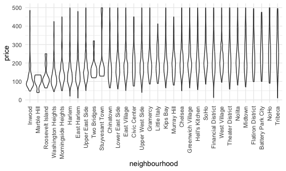

case_study
================
Bohan Zhu
2025-10-07

``` r
library(tidyverse)
```

    ## ── Attaching core tidyverse packages ──────────────────────── tidyverse 2.0.0 ──
    ## ✔ dplyr     1.1.4     ✔ readr     2.1.5
    ## ✔ forcats   1.0.0     ✔ stringr   1.5.1
    ## ✔ ggplot2   3.5.2     ✔ tibble    3.3.0
    ## ✔ lubridate 1.9.4     ✔ tidyr     1.3.1
    ## ✔ purrr     1.1.0     
    ## ── Conflicts ────────────────────────────────────────── tidyverse_conflicts() ──
    ## ✖ dplyr::filter() masks stats::filter()
    ## ✖ dplyr::lag()    masks stats::lag()
    ## ℹ Use the conflicted package (<http://conflicted.r-lib.org/>) to force all conflicts to become errors

``` r
library(p8105.datasets)


knitr::opts_chunk$set(
  fig.width = 6,
  fig.asp = .6,
  out.width = "90%"
)

theme_set(theme_minimal() + theme(legend.position = "bottom"))

options(
  ggplot2.continuous.colour = "viridis",
  ggplot2.continuous.fill = "viridis"
)

scale_colour_discrete = scale_colour_viridis_d
scale_fill_discrete = scale_fill_viridis_d

data(nyc_airbnb)
```

``` r
str(nyc_airbnb)
```

    ## spc_tbl_ [40,753 × 17] (S3: spec_tbl_df/tbl_df/tbl/data.frame)
    ##  $ id                            : num [1:40753] 7949480 16042478 1886820 6627449 5557381 ...
    ##  $ review_scores_location        : num [1:40753] 10 NA NA 10 10 10 10 9 10 9 ...
    ##  $ name                          : chr [1:40753] "City Island Sanctuary relaxing BR & Bath w Parking" "WATERFRONT STUDIO APARTMENT" "Quaint City Island Community." "Large 1 BDRM in Great location" ...
    ##  $ host_id                       : num [1:40753] 119445 9117975 9815788 13886510 28811542 ...
    ##  $ host_name                     : chr [1:40753] "Linda & Didier" "Collins" "Steve" "Arlene" ...
    ##  $ neighbourhood_group           : chr [1:40753] "Bronx" "Bronx" "Bronx" "Bronx" ...
    ##  $ neighbourhood                 : chr [1:40753] "City Island" "City Island" "City Island" "City Island" ...
    ##  $ lat                           : num [1:40753] -73.8 -73.8 -73.8 -73.8 -73.8 ...
    ##  $ long                          : num [1:40753] 40.9 40.9 40.8 40.8 40.9 ...
    ##  $ room_type                     : chr [1:40753] "Private room" "Private room" "Entire home/apt" "Entire home/apt" ...
    ##  $ price                         : num [1:40753] 99 200 300 125 69 125 85 39 95 125 ...
    ##  $ minimum_nights                : num [1:40753] 1 7 7 3 3 2 1 2 3 2 ...
    ##  $ number_of_reviews             : num [1:40753] 25 0 0 12 86 41 74 114 5 206 ...
    ##  $ last_review                   : Date[1:40753], format: "2017-04-23" NA ...
    ##  $ reviews_per_month             : num [1:40753] 1.59 NA NA 0.54 3.63 2.48 5.43 2.06 5 2.98 ...
    ##  $ calculated_host_listings_count: num [1:40753] 1 1 1 1 1 1 1 4 3 4 ...
    ##  $ availability_365              : num [1:40753] 170 180 365 335 352 129 306 306 144 106 ...

Let’s look at prices first

``` r
nyc_airbnb |> 
  drop_na(price) |> 
  group_by(room_type, neighbourhood_group) |> 
  summarize(
    mean_price = mean(price),
    mi_price = min(price),
    max_price = max(price)
  ) |> 
  pivot_wider(
    names_from = room_type,
    values_from = mean_price
  )
```

    ## `summarise()` has grouped output by 'room_type'. You can override using the
    ## `.groups` argument.

    ## # A tibble: 14 × 6
    ##    neighbourhood_group mi_price max_price `Entire home/apt` `Private room`
    ##    <chr>                  <dbl>     <dbl>             <dbl>          <dbl>
    ##  1 Bronx                     40       862              125.           NA  
    ##  2 Brooklyn                  11     10000              175.           NA  
    ##  3 Manhattan                 10      9999              238.          107. 
    ##  4 Queens                    20      1000              140.           NA  
    ##  5 Staten Island             49      5000              207.           NA  
    ##  6 Bronx                     25       850               NA            65.5
    ##  7 Brooklyn                  10     10000               NA            76.7
    ##  8 Queens                    12      6050               NA            70.6
    ##  9 Staten Island             22       300               NA            65.4
    ## 10 Bronx                     20       200               NA            NA  
    ## 11 Brooklyn                  16      2000               NA            NA  
    ## 12 Manhattan                 15      1500               NA            NA  
    ## 13 Queens                    17       300               NA            NA  
    ## 14 Staten Island             25        25               NA            NA  
    ## # ℹ 1 more variable: `Shared room` <dbl>

``` r
nyc_airbnb |> 
  count(neighbourhood_group, room_type)
```

    ## # A tibble: 15 × 3
    ##    neighbourhood_group room_type           n
    ##    <chr>               <chr>           <int>
    ##  1 Bronx               Entire home/apt   192
    ##  2 Bronx               Private room      429
    ##  3 Bronx               Shared room        28
    ##  4 Brooklyn            Entire home/apt  7427
    ##  5 Brooklyn            Private room     9000
    ##  6 Brooklyn            Shared room       383
    ##  7 Manhattan           Entire home/apt 10814
    ##  8 Manhattan           Private room     7812
    ##  9 Manhattan           Shared room       586
    ## 10 Queens              Entire home/apt  1388
    ## 11 Queens              Private room     2241
    ## 12 Queens              Shared room       192
    ## 13 Staten Island       Entire home/apt   116
    ## 14 Staten Island       Private room      144
    ## 15 Staten Island       Shared room         1

Make some plots

``` r
nyc_airbnb |> 
  ggplot(aes(x = price)) +
  geom_histogram() +
  facet_grid(room_type ~ neighbourhood_group)
```

    ## `stat_bin()` using `bins = 30`. Pick better value with `binwidth`.


``` r
  scale_x_continuous(limits = c(0, 1000))
```

    ## <ScaleContinuousPosition>
    ##  Range:  
    ##  Limits:    0 -- 1e+03

``` r
nyc_airbnb |> 
  filter(neighbourhood_group == "Manhattan",
           price <500,
         room_type == "Entire home/apt"
         ) |> 
  mutate(neighbourhood = fct_reorder(neighbourhood, price)) |> 
  ggplot(aes(x = neighbourhood, y = price)) +
  geom_violin() +
  theme(axis.text.x = element_text(angle = 90, hjust = 1, vjust = 0.5))
```



remember to look a t extreme values

``` r
nyc_airbnb |> 
  filter(price > 9000)
```

    ## # A tibble: 6 × 17
    ##         id review_scores_location name     host_id host_name neighbourhood_group
    ##      <dbl>                  <dbl> <chr>      <dbl> <chr>     <chr>              
    ## 1  3103784                     10 A Priva…  9.83e6 Michael   Brooklyn           
    ## 2  4737930                      8 Spanish…  1.24e6 Olson     Manhattan          
    ## 3   187529                     NA $3200/m…  9.02e5 Georgia   Manhattan          
    ## 4  9528920                      9 Quiet, …  3.91e6 Amy       Manhattan          
    ## 5 16429718                     NA Charmin…  1.36e7 Lena      Brooklyn           
    ## 6 12955683                      8 Great l…  3.57e7 Duan      Manhattan          
    ## # ℹ 11 more variables: neighbourhood <chr>, lat <dbl>, long <dbl>,
    ## #   room_type <chr>, price <dbl>, minimum_nights <dbl>,
    ## #   number_of_reviews <dbl>, last_review <date>, reviews_per_month <dbl>,
    ## #   calculated_host_listings_count <dbl>, availability_365 <dbl>

``` r
nyc_airbnb |> 
  filter(calculated_host_listings_count > 30)
```

    ## # A tibble: 68 × 17
    ##          id review_scores_location name    host_id host_name neighbourhood_group
    ##       <dbl>                  <dbl> <chr>     <dbl> <chr>     <chr>              
    ##  1 15057686                     NA Home 4…  2.64e7 Stat      Brooklyn           
    ##  2 15080936                     NA Home 4…  2.64e7 Stat      Brooklyn           
    ##  3 14776203                     10 Home 4…  2.64e7 Stat      Brooklyn           
    ##  4 15074005                     NA Home 4…  2.64e7 Stat      Brooklyn           
    ##  5  5866656                     NA Home 4…  2.64e7 Stat      Brooklyn           
    ##  6  5538353                     NA Home 4…  2.64e7 Stat      Brooklyn           
    ##  7  5632551                     10 Home 4…  2.64e7 Stat      Brooklyn           
    ##  8  7788565                     NA Home 4…  2.64e7 Stat      Brooklyn           
    ##  9  7789408                      9 Home4 …  2.64e7 Stat      Brooklyn           
    ## 10  7789213                     10 Home 4…  2.64e7 Stat      Brooklyn           
    ## # ℹ 58 more rows
    ## # ℹ 11 more variables: neighbourhood <chr>, lat <dbl>, long <dbl>,
    ## #   room_type <chr>, price <dbl>, minimum_nights <dbl>,
    ## #   number_of_reviews <dbl>, last_review <date>, reviews_per_month <dbl>,
    ## #   calculated_host_listings_count <dbl>, availability_365 <dbl>

Keep looking at location

``` r
nyc_airbnb |> 
  filter(neighbourhood_group == "Manhattan",
           price <1000,
         room_type == "Entire home/apt"
         ) |> 
  ggplot(aes(x = lat, y = long, color = review_scores_location)) +
  geom_point()
```


